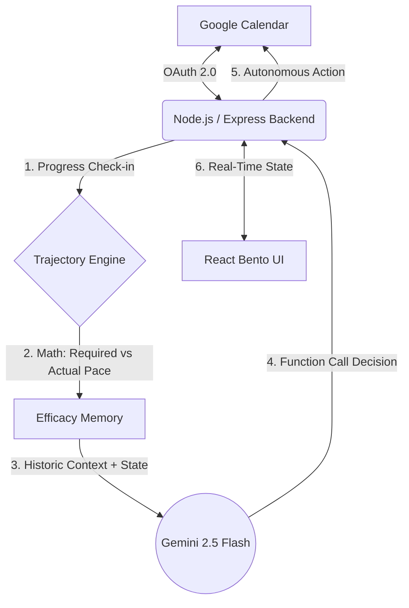

# 🌊 Drift: Autonomous AI Scheduling Agent

Drift is a proactive calendar agent that mathematically tracks your "trajectory" toward deadlines. Unlike standard task managers that rely on passive notifications, Drift continuously calculates the required pace of work. If a user starts to drift off course, the agent autonomously intervenes.

This project was built for the **Vibe 2 Ship** Hackathon.

---

## 🏗️ System Architecture & Workflow

Drift operates on a closed-loop architecture. It does not just send prompts to an LLM; it calculates math, observes the result, and stores the efficacy of its own actions.



### The Efficacy Memory Loop (Key Innovation)
1. **Math, not vibes**: The `Trajectory Engine` calculates exact divergence.
2. **Action**: The Agent attempts an intervention (e.g. `send_nudge`).
3. **Feedback**: If the user ignores the nudge twice, the `Efficacy Memory` records it as a failure.
4. **Escalation**: Gemini recognizes the failure and is forced to escalate to a stronger tool (e.g. `propose_renegotiation`).

---

## ✨ Features
* **Mathematical Trajectory Engine**: Continuously calculates required task pace based on elapsed time and historical user data.
* **Autonomous Calendar Rescheduling**: Automatically reshuffles time blocks via the Google Calendar API to save missed deadlines.
* **Dynamic Bento UI**: A GenZ-focused, highly dynamic editorial layout using Framer Motion spring-physics for maximum engagement.
* **Real-time Voice Synthesis**: The agent verbally announces its internal reasoning trace when it decides to intervene.
* **Accessible & Secure**: Includes strict ARIA accessibility standards and global Express error handlers to guarantee high availability.

---

## 🔒 Security & Environment
Security was a top priority for this hackathon submission:
- **Zero Secrets in Frontend**: The React frontend contains zero API keys. All API keys (Gemini, Google Calendar) are handled securely on the Node.js backend.
- **`.env` Protection**: All secrets are isolated in `.env` files which are strictly excluded via `.gitignore` and `.dockerignore`.
- **Global Error Catching**: Express utilizes a global middleware error catcher, ensuring that malformed AI outputs or unauthorized API requests never crash the live server.

---

## 🛠️ Technologies Used
- **Frontend**: React, Vite, TailwindCSS, Framer Motion, Recharts
- **Backend**: Node.js, Express.js
- **AI & Integration**: Google Gemini 2.5 Flash, Google Calendar API
- **Infrastructure & Testing**: Google Cloud Run, Jest, Docker

---

## ⚙️ Running Locally
1. Clone the repository
2. Install backend dependencies: `npm install`
3. Install frontend dependencies: `cd frontend && npm install`
4. Create a `.env` file in the root directory with `GEMINI_API_KEY=your_key`
5. Run the frontend: `cd frontend && npm run dev`
6. Run the backend: `node index.js`

## 🧪 Testing
We wrote rigorous mathematical unit tests to verify the core scheduling algorithm. Run the tests using:
```bash
npx jest trajectoryEngine.test.js
```
